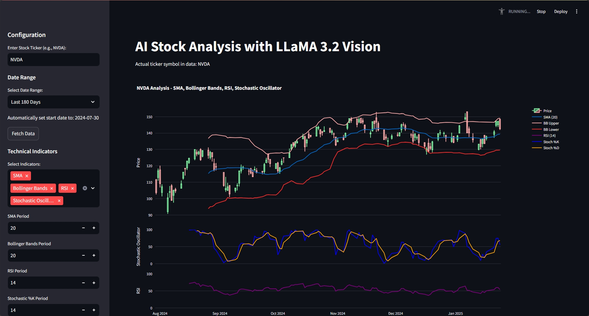
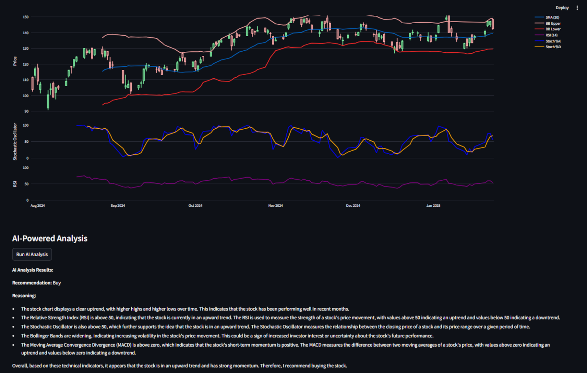

# AI Stock Analysis Tool





## Disclaimer

⚠️ **Important:** This software is provided for educational purposes only. It should NOT be used as financial advice or for making investment decisions. Always consult with a qualified financial advisor before making any investment decisions.

## Description

This tool provides AI-powered analysis of stock market data using advanced visualization and machine learning techniques. It helps users understand market trends and patterns through interactive charts and automated analysis.

## Features

- Interactive stock price visualization
- AI-powered trend analysis
- Technical indicator overlays
- Customizable chart recordings
- Automated pattern recognition

## Technical Analysis Indicators

The tool offers a comprehensive suite of technical analysis indicators that users can experiment with:

- **Moving Averages (SMA/EMA)**: Track price trends over different time periods
- **MACD (Moving Average Convergence Divergence)**: Identify momentum shifts and trend changes
- **RSI (Relative Strength Index)**: Measure overbought and oversold conditions
- **Stochastic Oscillator**: Analyze price momentum and trend reversals
- **ATR (Average True Range)**: Gauge market volatility
- **OBV (On-Balance Volume)**: Track volume flow to confirm price trends
- **Ichimoku Cloud**: Multi-faceted indicator for trend direction, support, and resistance levels

Users can combine multiple indicators, adjust their parameters, and observe their interactions on the interactive chart. This allows for developing and testing various trading strategies while understanding how different technical indicators complement each other in market analysis.

## Installation

1. Clone this repository
2. Install required dependencies:

```python
pip install -r requirements.txt
```

## Usage

## Usage

Run the application using:

```python
streamlit run analyseStock.py
```

Contributing
Contributions are welcome! Please feel free to submit a Pull Request.

License
MIT License

Copyright (c) 2024

Permission is hereby granted, free of charge, to any person obtaining a copy of this software and associated documentation files (the "Software"), to deal in the Software without restriction, including without limitation the rights to use, copy, modify, merge, publish, distribute, sublicense, and/or sell copies of the Software, and to permit persons to whom the Software is furnished to do so, subject to the following conditions:

The above copyright notice and this permission notice shall be included in all copies or substantial portions of the Software.

THE SOFTWARE IS PROVIDED "AS IS", WITHOUT WARRANTY OF ANY KIND, EXPRESS OR IMPLIED, INCLUDING BUT NOT LIMITED TO THE WARRANTIES OF MERCHANTABILITY, FITNESS FOR A PARTICULAR PURPOSE AND NONINFRINGEMENT. IN NO EVENT SHALL THE AUTHORS OR COPYRIGHT HOLDERS BE LIABLE FOR ANY CLAIM, DAMAGES OR OTHER LIABILITY, WHETHER IN AN ACTION OF CONTRACT, TORT OR OTHERWISE, ARISING FROM, OUT OF OR IN CONNECTION WITH THE SOFTWARE OR THE USE OR OTHER DEALINGS IN THE SOFTWARE. ```
